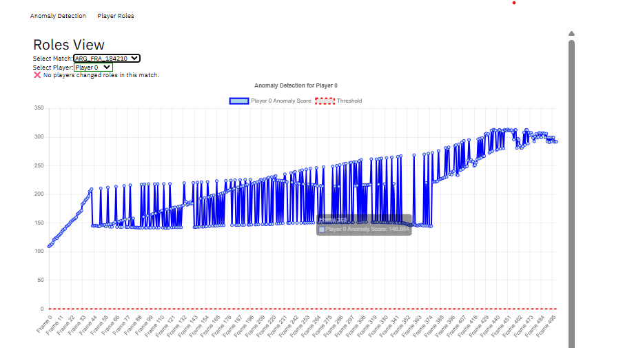
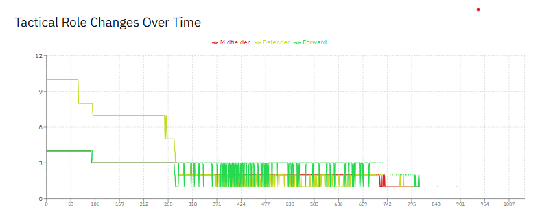
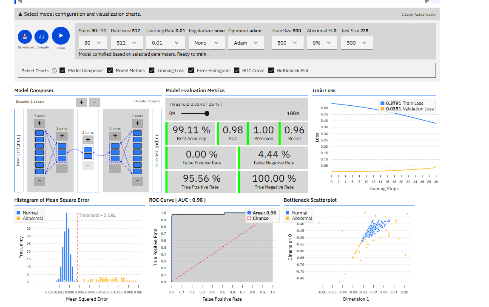

# Football Player Anomaly Detection and Visualization

This project applies **unsupervised anomaly detection** to **football player tracking data** and visualizes the results using an **interactive web dashboard**.  

By leveraging **autoencoders** and **role-based analytics**, the system highlights **unusual player movements, tactical shifts, and pressing events** without requiring labeled data.  

It combines:
- **Python preprocessing and anomaly scoring**
- **JSON-based data export for a browser-based autoencoder**
- **Anomagram (React + TensorFlow.js) dashboard for interactive visualization**

---

## ⚡ Features

- **Player Anomaly Detection:** Detect unusual player movements using autoencoder reconstruction error.
- **Role-Based Analysis:** Assign dynamic roles to players frame-by-frame.
- **Tactical Change Visualization:** Track how team structure changes across the match.
- **Interactive Dashboard:** Explore anomalies, timelines, and role charts in your browser.

---

## 📂 Project Structure

```
fifa-skeletal-light/
├── README.md                    # This file
├── boxes.npz                    # Example raw bounding-box file
├── cameras/                     # NPZ input data (per match)
│   └── ARG_CRO_000737.npz
├── Pre_processing/               # Python scripts for preprocessing
│   ├── combine_frames.py
│   ├── main_preprocessing.py
│   ├── pre_process.py
│   ├── preprocess_frame.py
│   ├── add_roles.py
│   ├── create_chart_ready_json.py
│   ├── run.py
│   └── visuals.py
├── experimental/                 # Optional: notebooks & trials
├── anomagram-master/             # React + TensorFlow.js dashboard
│   ├── app/
│   ├── experiments/
│   ├── readme.md                 # Original dashboard instructions
│   └── LICENSE
├── images/                       # Add screenshots here for README
│   ├── player_anomaly_example.png
│   └── tactical_change_example.png
└── Project_Report.pdf            # Optional: final academic report
```

---

## 📊 Workflow

```
NPZ (bounding boxes)
        ↓
Python preprocessing (Pre_processing/)
        ↓
CSV → JSON generation
        ↓
Anomagram in-browser autoencoder
        ↓
Anomaly scores + role visualizations
```

- **Input:** NPZ files with 21-player bounding boxes per frame  
- **Output:** `_scored.json` files with per-frame anomaly scores for dashboard visualization  

---

## ▶️ Quick Start

### **1. Python Preprocessing**
1. Install Python dependencies:
```bash
pip install -r requirements.txt
```
2. Convert NPZ → CSV and JSON:
```bash
cd Pre_processing
python run.py
python create_chart_ready_json.py
```

---

### **2. Launch Dashboard (Anomagram)**
1. Navigate to the React app:
```bash
cd ../anomagram-master/app
npm install
npm start
```
2. Open `http://localhost:3000` in your browser:
   - Train the autoencoder (live in-browser)
   - View reconstruction loss and ROC curve
   - Download `_scored.json` files with anomaly scores
   - Explore **Roles View** for tactical insights

---

## 📸 Example Outputs

Place your exported images in the `/images` folder, then reference them here.

**1. Player Anomaly Timeline**  
Shows frame-by-frame anomaly scores, with spikes highlighting unusual events.  



---

**2. Roles View – Tactical Role Changes**  
Visualizes changes in player roles and anomalies over the match.  



---

*(Optional)* **3. Dashboard Screenshot**  
Demonstrates the interactive Anomagram interface with live charts.  



---

## 🏆 Key Findings

- Autoencoders can **detect unusual football behaviors** without labeled data.  
- **Reconstruction error spikes** often correspond to pressing or counter-attacks.  
- **Role-based aggregation** highlights tactical changes more clearly than raw anomalies.

---

## 📄 Academic Context

This project is based on Emmanuel Oloruntola’s **Final Year Project**:  
*Anomaly Detection in Football Player Tracking Using Autoencoders for Data Visualization*  
- University of East Anglia, 2025  
- Supervised by Mr. Cheng Wang  

The full report is included as `Project_Report.pdf`.

---

## 🔧 Requirements

### **Python**
```
numpy
pandas
matplotlib
scikit-learn
joblib
```

### **Node.js (for dashboard)**
- Node.js ≤ 16.20.2  
- React 18  
- TensorFlow.js  

---

## 🙌 Acknowledgements

- [FIFA Skeletal Light Dataset](https://www.kaggle.com/competitions/fifa-skeletal-light)  
- [Anomagram by Victor Dibia](https://github.com/victordibia/anomagram)
